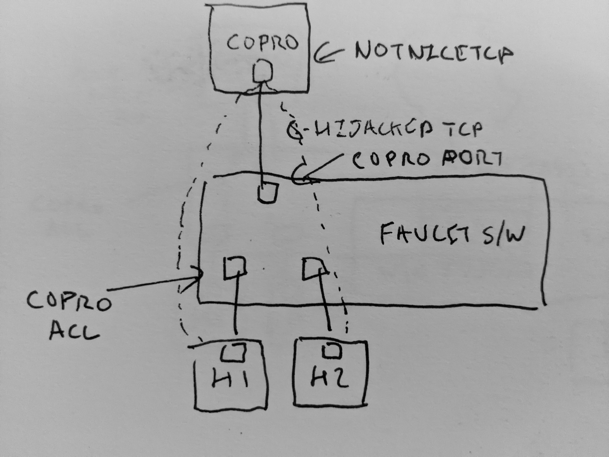

# notnicetcp
Make TCP worse

Install and usage
=================

Arrange for FAUCET coprocessor to send traffic to "copro0" host interface,
using a FAUCET ACL to match traffic and send it to a coprocessor port.

This eBPF program will hairpin TCP back into FAUCET's pipeline, only worse
(currently looks for a HTTP GET and breaks it - but could be changed
to randomly break payload in any packet).

    sudo apt-get install bpfcc-tools python3-bpfcc
    sudo ./notnicetcp.py --device=copro0

